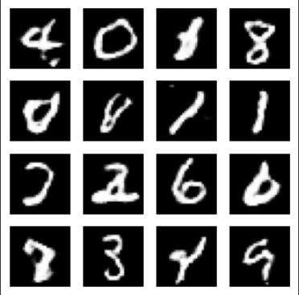

# 🖼️ Fake Handwritten Digit Generation using GAN (MNIST)

This project demonstrates the use of **Generative Adversarial Networks (GANs)** to generate realistic fake images of handwritten digits using the **MNIST dataset**. The generator progressively learns to create convincing digit images, while the discriminator learns to differentiate between real and fake images.

---

## 🚀 Project Overview
- **Goal:** Generate fake handwritten digit images similar to MNIST digits.
- **Model Type:** Generative Adversarial Network (GAN)
- **Framework:** TensorFlow / Keras (you can update this to the one you used)

 Key Features
Dataset: MNIST handwritten digits

Generator:

Conv2DTranspose layers for image generation

Leaky ReLU activations

Batch Normalization for training stability

Dropout for regularization

Discriminator:

Convolutional layers

Leaky ReLU activations

Dropout to prevent overfitting

Training:

150 epochs

Binary Cross-Entropy Loss

Separate optimizers for generator and discriminator

Output:

Generated images saved at each epoch in JPG format

Visual tracking of generator progress

📊 Results
Generator improves image quality across epochs.

Early epochs produce noisy outputs, later epochs generate clearer digits.

Example:

